# Alexa RSS Mapper Service
This service is based on RHMAP's API Mapper, which is a visual tool for transforming the response of JSON APIs. It allows users to:

* Rename Fields
* Exclude fields which are not needed
* Transform Fields using built-in transformations, or custom transforms they have defined themselves

## Usage in the RSS Reader Demo
For our demo, we are using the RSS Mapper Service to streamline the response from the [Connector Service](https://github.com/mmetting/RSS-Reader-Demo-RSS-Connector). In order to enabling a web service being usable within an Alexa Flash Briefing Skill, the service's interface needs to adhere to the [Flash Briefing Skill API](https://developer.amazon.com/public/solutions/alexa/alexa-skills-kit/docs/flash-briefing-skill-api-feed-reference).

> In order to use the Mapping Service, the [Connector Service](https://github.com/mmetting/RSS-Reader-Demo-RSS-Connector) would need to be deployed and reachable from the internet. To check your Connector Service, try to reach it via a browser: 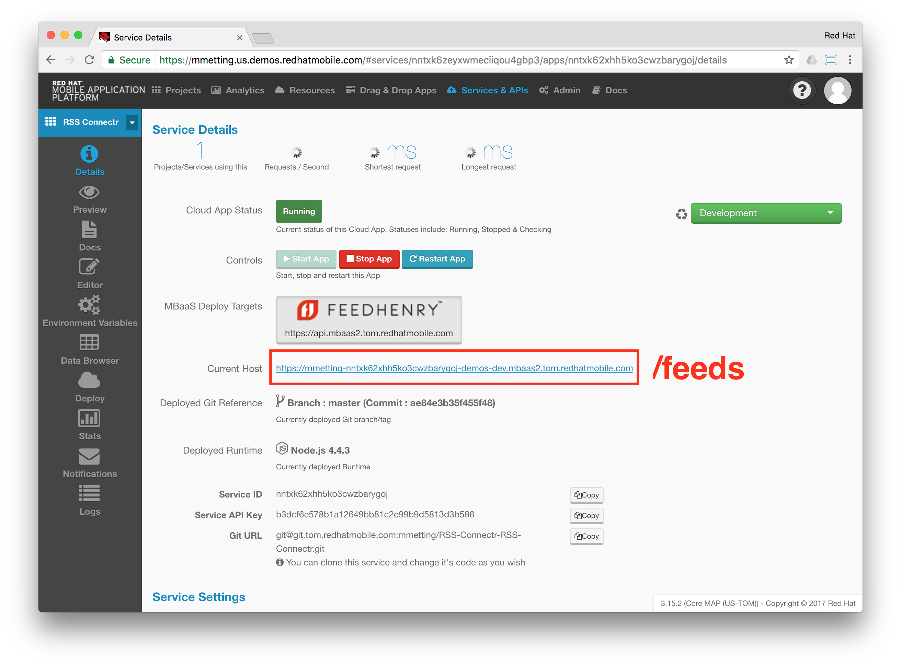 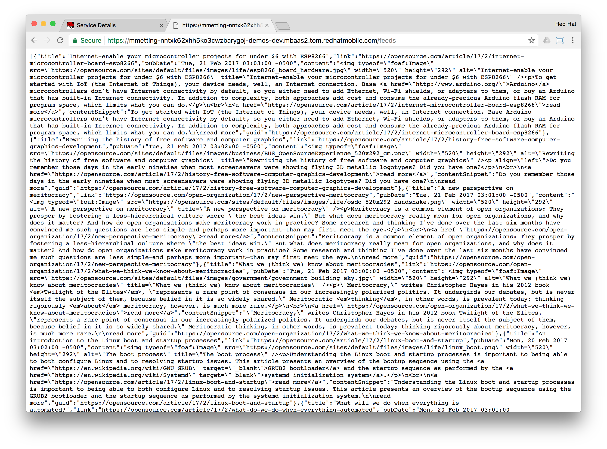

## Provision a new API Mapper Service
### Prepare

- Click on `MBaaS Services & APIs`
- Select `Provision a new MBaaS Service/API`
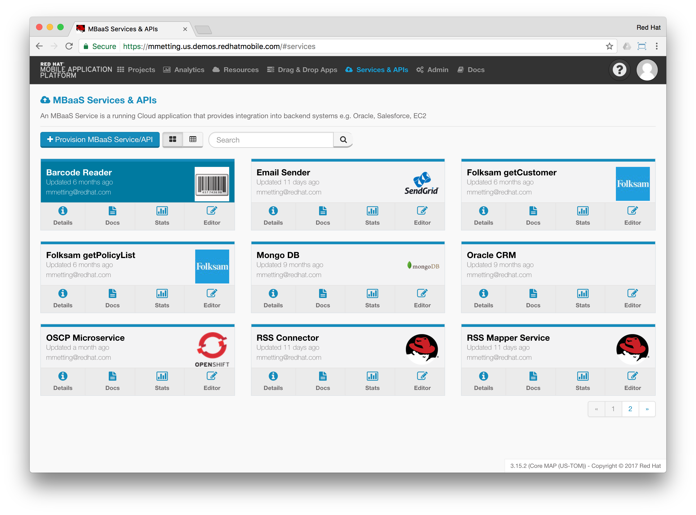

- Choose the `API Mapper` template
- Name your new Service: e.g. `Alexa RSS Mapper` or `RSS Mapper` 
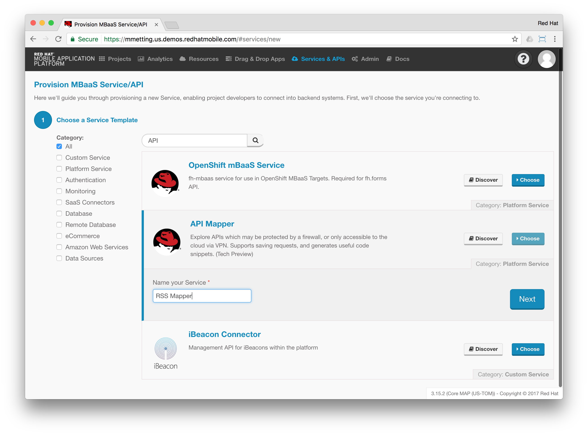

- Click `Next`
- Wait for the service to provision
- Click `Finish`, you'll be directed to the details screen of your new service.
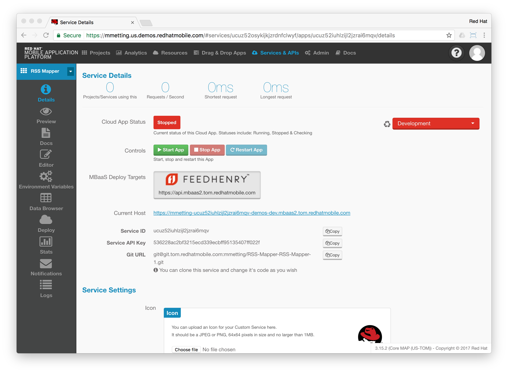

- Scroll down and make the MBaaS Service `public` and add it to the RSS project.
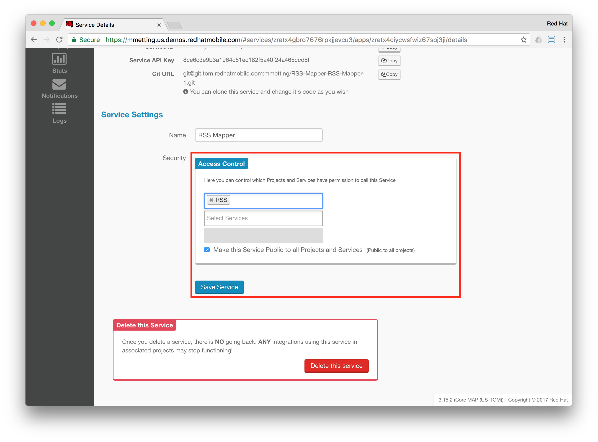

- Select the `Deploy` tab in the AppStudio and deploy the MBaaS service:
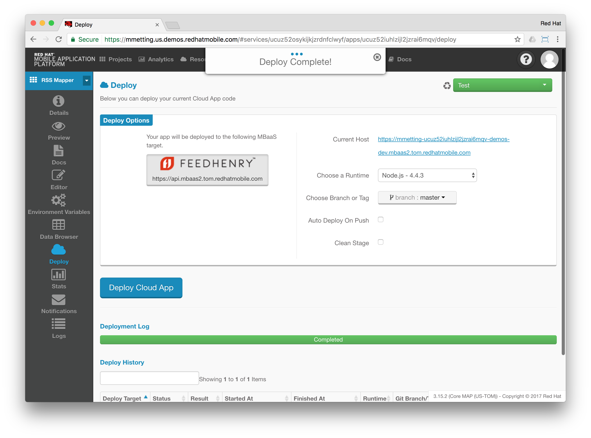

- Visit the data browser, depending on your application configuration a `Upgrade Database` action will be available, this means the application is using an old/legacy shared database and it needs to be upgraded to use a dedicated one. Note the application needs to be first finished its initial deploy and be running to perform this task.
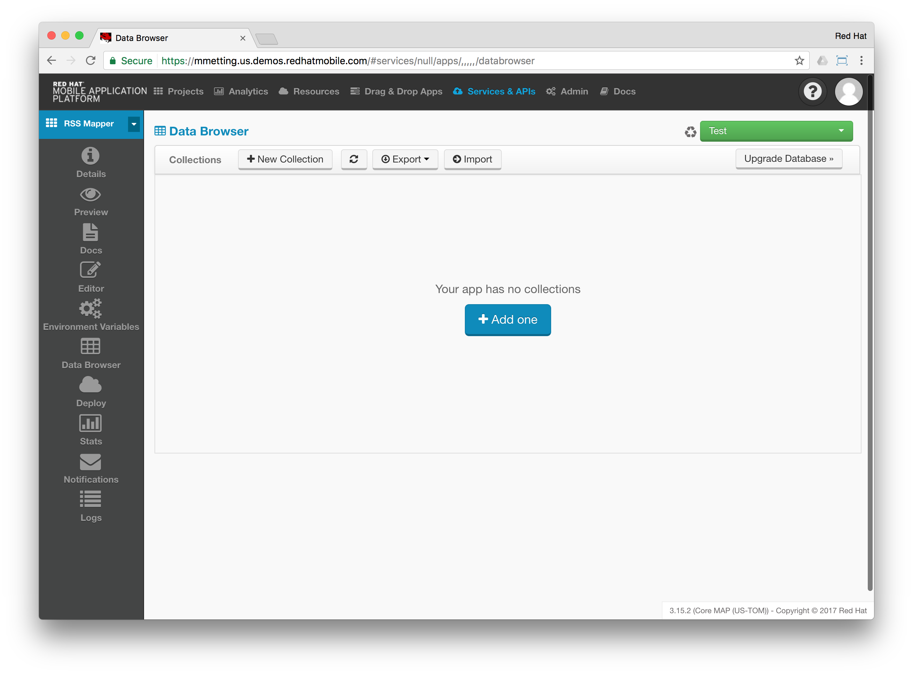

- Click `Upgrade now`
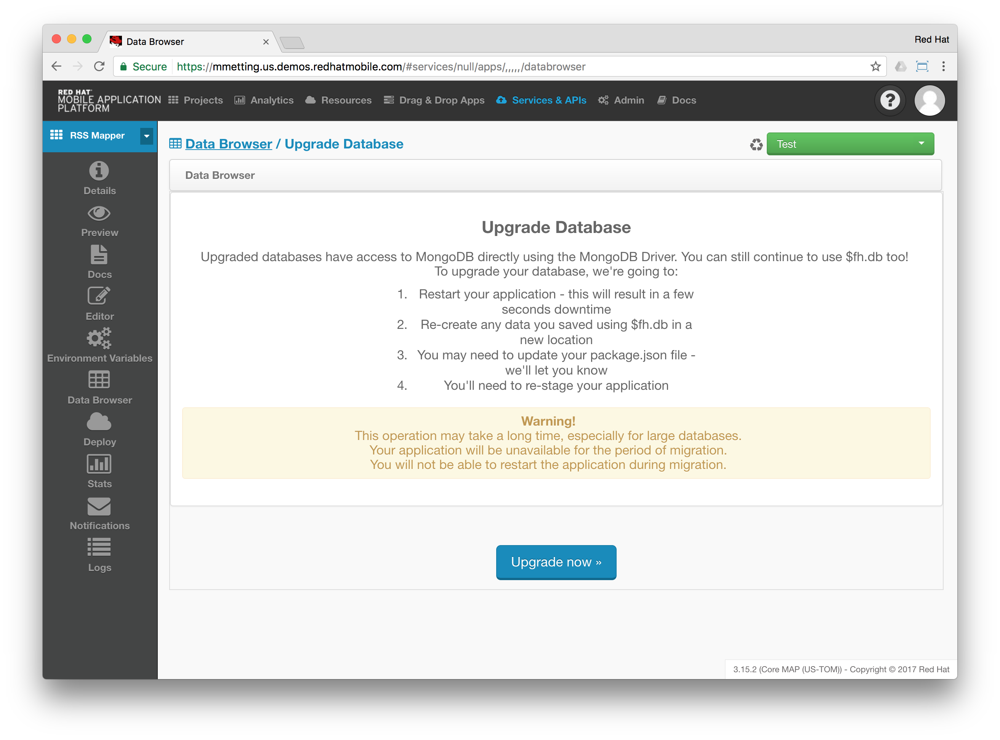

- Click `Next` and Re-deploy the service

### Add the transformation implementations to the service

- Click the `Editor` tab
- Expand the `transformations` folder
- Add a new file in the `transformations` by clicking `File -> New File`

- Name the new file: `alexaDateTransform.js`
- Add the following code snippet to the newly created [file](./transformations/alexaDateTransform.js) and save it:

```
// First, tell the mapper what value types this transformation is valid for
exports.type = "string";
// Then, implement the transformation function

var months = [{
    long: "January",
    short: "Jan"
},
{
    long: "February",
    short: "Feb"
},
{
    long: "March",
    short: "Mar"
},
{
    long: "April",
    short: "Apr"
},
{
    long: "May",
    short: "May"
},
{
    long: "June",
    short: "Jun"
},
{
    long: "July",
    short: "Jul"
},
{
    long: "August",
    short: "Aug"
},
{
    long: "September",
    short: "Sep"
},
{
    long: "October",
    short: "Oct"
},
{
    long: "November",
    short: "Nov"
},
{
    long: "December",
    short: "Dec"
}
];

exports.transform = function (content) {

    if (content.length > 0) {
        var arrayOfStrings = content.split(" ");
        if (arrayOfStrings.length == 6) {
            //Year
            var yyyy = arrayOfStrings[3];
            
            //Month
            var MM = 0;

            var month = arrayOfStrings[2];

            console.log(month);

            for (var i = 0; i < months.length; i++) {
                var long = months[i].long;
                var short = months[i].short;

                console.log(long);
                console.log(short);

                if (month === long || month === short) {
                    MM = i + 1;

                    console.log("Match" + i);
                }

                console.log("MM" + MM);
            }

            if (MM < 10) {
                MM = "0" + MM.toString();

                console.log("MM" + MM);
            } else {
                MM = MM.toString();

                console.log("MM" + MM);
            }

            console.log("MM" + MM);

            //Day
            var dd = arrayOfStrings[1];

            //Time
            var time = arrayOfStrings[4];

            //Result
            var result = yyyy + "-" + MM + "-" + dd + "T" + time + ".0Z";
            return result;
        }

    }

    return content;
};

```
- Add another new file in the `transformations` folder by clicking `File -> New File`

- Name the new file: `alexaRemoveReadMore.js`
- Add the following code snippet to the newly created [file](./transformations/alexaRemoveReadMore.js) and save it:

```
// First, tell the mapper what value types this transformation is valid for
exports.type = "string";
// Then, implement the transformation function

exports.transform = function (content) {

    if (content.length > 0) {
        var removeReadMore = content.substr(0, content.indexOf('\n\nread more')); 
        return removeReadMore;
    }

    return content;
};
```

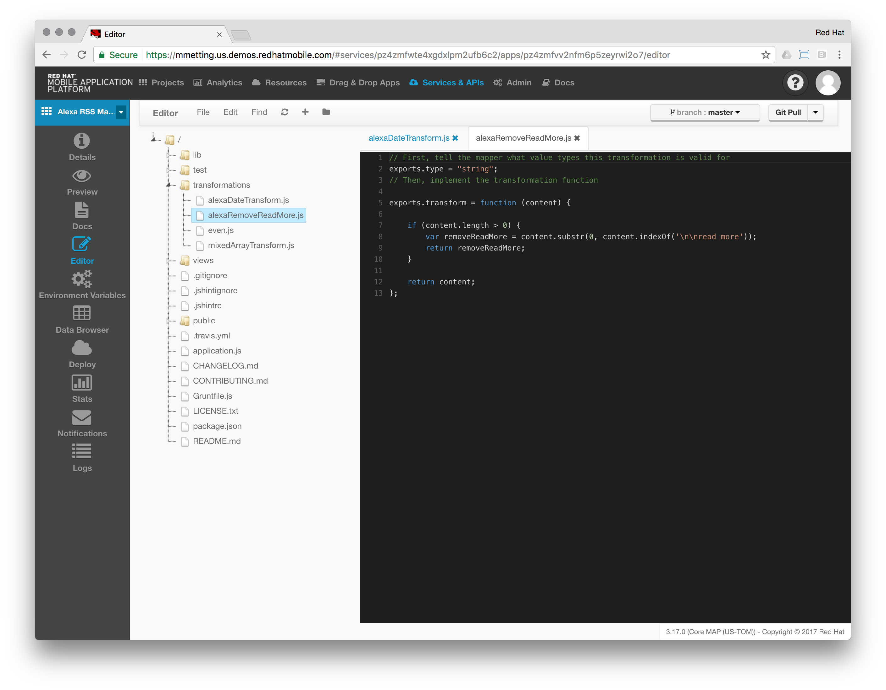

- Open the [`application.js`](./application.js) file and add the transformations to the Node.js application:

```
...
app.use('/', apiMapper({
  transformations: {
    // Add your custom transformations here! `customMixedArrayTransform` is an example of this.
    mixedArrayTransform: require('./transformations/mixedArrayTransform.js'),
    alexaDateTransformation: require('./transformations/alexaDateTransform.js'),
    alexaRemoveReadMore: require('./transformations/alexaRemoveReadMore.js')
  }
}));
...
```
- Save your changes
- Select the `Deploy` tab in the AppStudio and deploy the MBaaS service:


### Configure the service

- Click on the `Preview` tab
- Select `Create New Request`
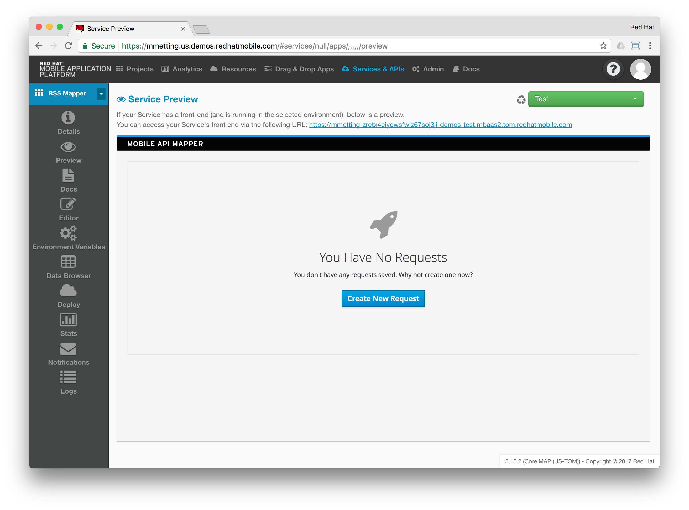

- Specify the URL of the deployed [Connector Service](https://github.com/mmetting/RSS-Reader-Demo-RSS-Connector)
- Specify `/feeds` as the Mount Path
- Click `Create Request` 
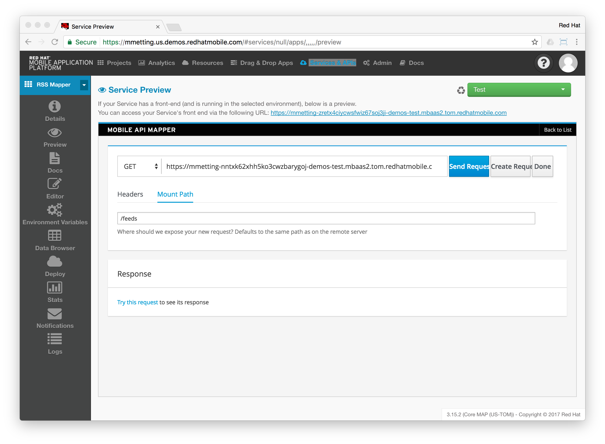

- Click `Add Mapping+`
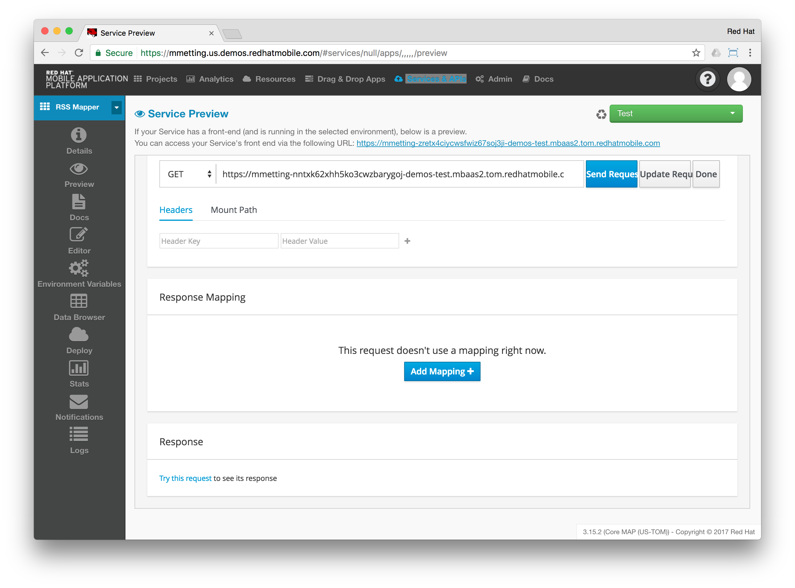

- Expand the Array items section
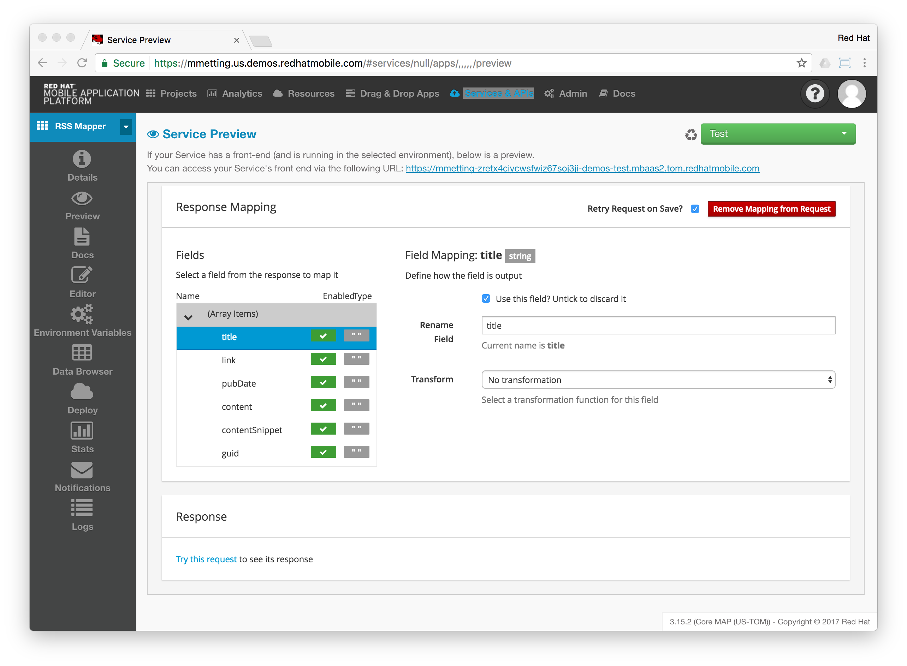

- Click on the `title` array item:
    - Rename to `titleText`
- Click on the `link` array item:
    - Rename to `redirectionUrl`
- Click on the `pubDate` array item:
    - Rename to `updateDate`
    - Select the `alexaDateTransform` transformation
- Click on the `content` array item and un-check `Use this field?`
- Click on the `contentSnippet` array item:    
    - Rename to `mainText`
    - Select the `alexaRemoveReadMore` transformation
- Click on the `guid` array item:
    - Rename to `uid`

- The final result should look like the following:
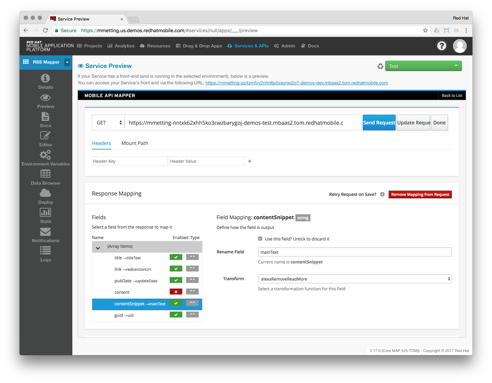

- Click `Done`
- Select the `Deploy` tab in the AppStudio and deploy the MBaaS service:
